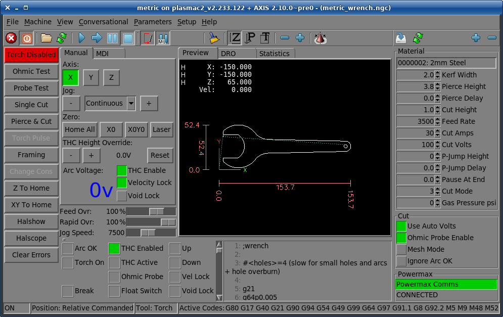
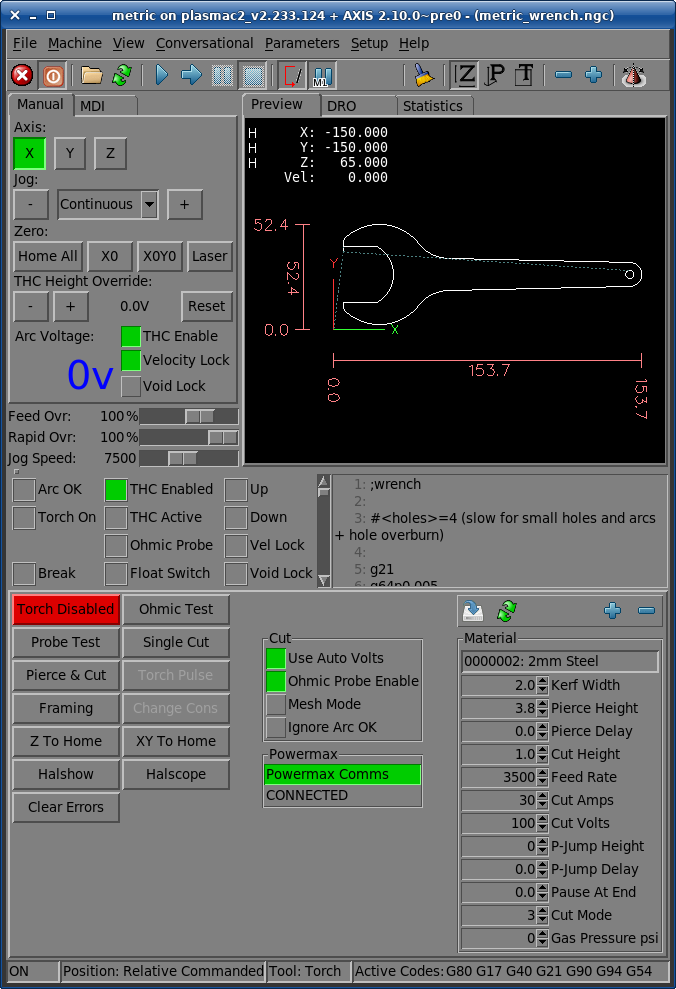

# plasmac2
A plasma add-on for the AXIS GUI using LinuxCNC master branch. (v2.9)

The landscape screenshot below is a window size of 983 x 562 which is the smallest practical size for a 10 point font.



The portrait screenshot below is a window size of 662 x 918 which is the smallest practical size for a 10 point font.



The window may be resized to any larger size and the font size may be changed from 7 to 20 points.
## Installation
### Requirements for using plasmac2 are:
  * A working version of LinuxCNC V2.9 or later
  * A working QtPlasmaC configuration
  * git
  * python3-git


### To install LinuxCNC:
One method is to download the current [LinuxCNC ISO](https://www.linuxcnc.org/iso/linuxcnc-2.8.4-buster.iso) and then changed the sources to the LinuxCNC BuildBot as described [here](http://buildbot.linuxcnc.org/).

There are various alternative methods for [installing LinuxCNC](https://forum.linuxcnc.org/9-installing-linuxcnc) shown on the LinuxCNC forum.

### To install QtPlasmaC:
Configuring QtPlasmaC for an existing LinuxCNC installation is described [here](http://linuxcnc.org/docs/devel/html/plasma/qtplasmac.html#configuring).


### To install git:
From a terminal enter:
```console
sudo apt install git
```


### To install python3-git:
From a terminal enter:
```console
sudo apt install python3-git
```


### To install plasmac2:
From a terminal enter:
```console
git clone https://github.com/phillc54/plasmac2.git ~/linuxcnc/plasmac2
```


### To create a plasmac2 configuration:
From a terminal enter;
```console
python3 ~/linuxcnc/plasmac2/source/setup.py
```

From the setup application either a migration or simulator creation may be done.
  * click **Migration** to create a new plasmac2 config based on an existing QtPlasmaC config.
  * click **Simulation** to create a new plasmac2 simulator config.

A migration will create a completely new plasmac2 configuration based on the selected QtPlasmaC configuration.

The existing QtPlasmaC configuration will be left as is.

### To update plasmac2 there are two options:
From the plasmac2 GUI:  
click **Help** then click **Update**

From a terminal:
```console
cd ~/linuxcnc/plasmac2
git pull
```


## Notes:
There are some different keyboard shortcuts in plasmac2 compared to AXIS.

All shortcuts are shown in the Help menu if keyboard shortcuts are enabled.

